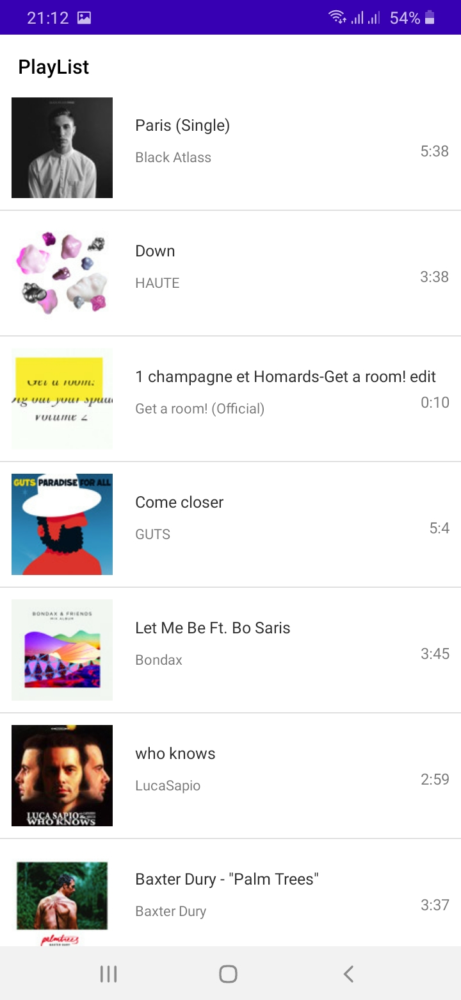
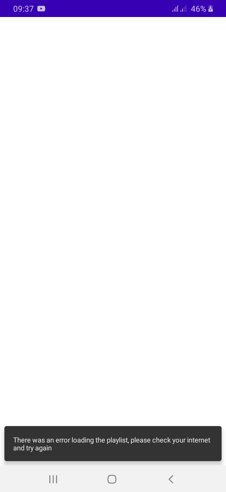
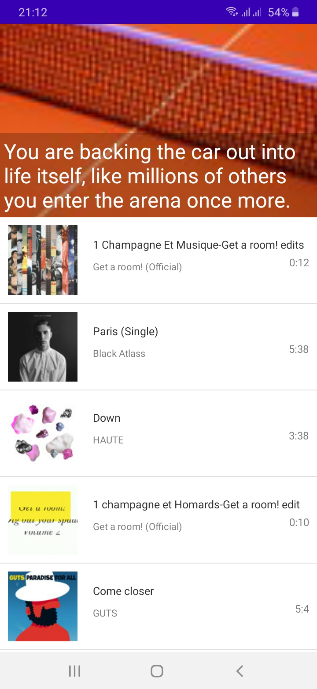
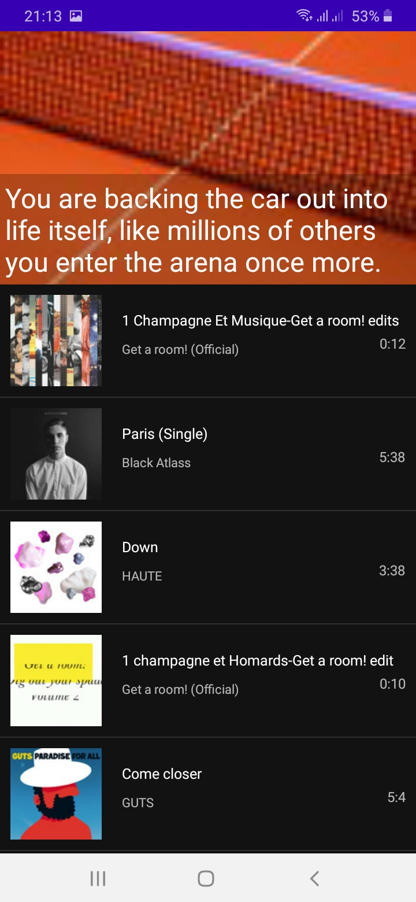

# SoundCloud App

An Android app consuming [SoundCloud Api](https://developers.soundcloud.com/docs) to display a sample playlist consisiting of list of tracks, built with MVVM pattern as well as Architecture Components.

Min Api Level : 21 [Supports Over 87% Devices ](https://developer.android.com/about/dashboards)

Build System : [Gradle](https://gradle.org/)

## Table of Contents

- [Prerequisite](#prerequisite)
- [The App](#theApp)
- [Architecture](#architecture)
- [Testing](#testing)
- [Libraries](#libraries)
- [Demo](#demo)

## Prerequisite

This project uses the Gradle build system. To build this project, use the
`gradlew build` command or use "Import Project" in Android Studio.

## The App
The app has single screen, a fragment  that is automatically added to activity_main layout. The ui has a collapsing toolbar which contains the Playlist artwork and the title. Under it there is a recyclerview which displays the list of tracks present in the playlist. When the data is loading the progressbar is shown, which is hidden when there is an error or the data has been fetched. Also, a snackbar is shown when there is an error.

## Architecture
The app is built using the MVVM architectural pattern and make heavy use of a couple of Android Jetpack components. Mvvm allows for the separation of concern which also makes testing easier. The app has a fragment which communicates to Viewmodel which in turn communacates to the Repository to get data. 

## Testing
With MVVM testing  is made easier in that Ui can be tested separately from the businnes logic. Mocking the viewmodel to test the fragment for user interaction using espresso, mocking the repository to test the viewmodel with Junit as well as mocking the api service to test the repository using the Junit.
 
## Libraries

Libraries used in the whole application are:

- [Jetpack](https://developer.android.com/jetpack)🚀
  - [Viewmodel](https://developer.android.com/topic/libraries/architecture/viewmodel) - Manage UI related data in a lifecycle conscious way
  - [Data Binding](https://developer.android.com/topic/libraries/data-binding) - support library that allows binding of UI components in  layouts to data sources,binds character details and search results to UI
- [Retrofit](https://square.github.io/retrofit/) - Type safe http client 
and supports coroutines out of the box.  Used for the newtwork calls.
- [Gson](https://github.com/google/gson) - Used to convert Json to Java/Kotlin classes for thr Retrofit
- [okhttp-logging-interceptor](https://github.com/square/okhttp/blob/master/okhttp-logging-interceptor/README.md) - logs HTTP request and response data.
- [kotlinx.coroutines](https://github.com/Kotlin/kotlinx.coroutines) - Library Support for coroutines
-  [Dagger2](https://dagger.dev/dev-guide/) - Used for Dependency injection
- [Glide](https://github.com/bumptech/glide) - Allows for fetching and displaying of images to imageviews

## Demo

||||
|:----:|:----:|:----:|

|||
|:----:|:----:|

||
|:----:|

||
|:----:|

